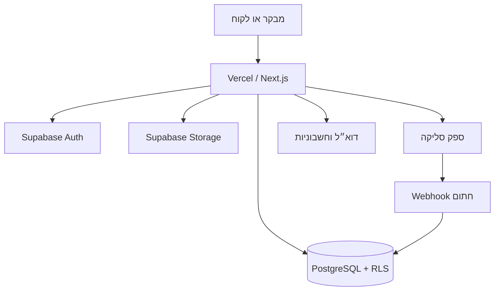
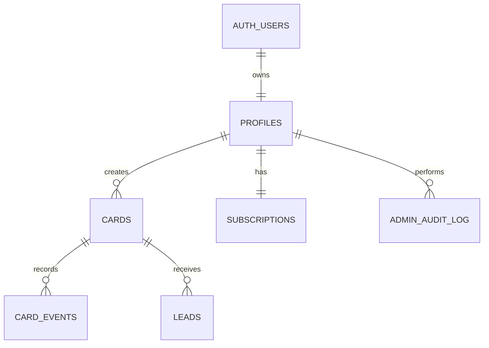

# ארכיטקטורה ומודל נתונים

## מבנה כללי

## שכבות

- `src/app`: מסכים, Route Handlers, Metadata ו־Server Actions.
- `src/components`: רכיבי שיווק, Dashboard, בונה הכרטיס והכרטיס הציבורי.
- `src/lib/data.ts`: Data Access Layer מרכזי לקריאות שרת.
- `src/lib/supabase`: לקוחות Browser, Server ו־Service Role מופרדים.
- `src/lib/validation.ts`: סכמות Zod לגבולות אמון.
- `src/lib/payments.ts`: Adapter ספק סליקה.
- `supabase/migrations`: סכמת מסד, RLS, אינדקסים ו־Storage.

## ישויות מרכזיות

## אבטחה והרשאות

- Supabase Auth מנהל סשן מאובטח בעוגיות.
- Proxy מרענן סשן, אך כל API ו־Server Action בודקים זהות בעצמם.
- RLS מגביל Cards, Leads, Events ו־Subscriptions לבעלים שלהם.
- Service Role משמש רק בקוד שרת לפעולות ציבוריות מבוקרות ול־Admin.
- Webhook דורש HMAC-SHA256 ונשמר בטבלת `payment_events` למניעת עיבוד חוזר.
- העלאות מוגבלות לפי MIME וגודל ונשמרות תחת תיקיית המשתמש.
- פרטי כרטיס אשראי אינם נכנסים למערכת.

## מצב הדגמה

כאשר Supabase אינו מוגדר, שכבת הנתונים מחזירה משתמש, כרטיס ואנליטיקה לדוגמה. שמירת עורך במצב זה נשמרת ב־localStorage בלבד. אין להשתמש במצב זה כמאגר Production.
